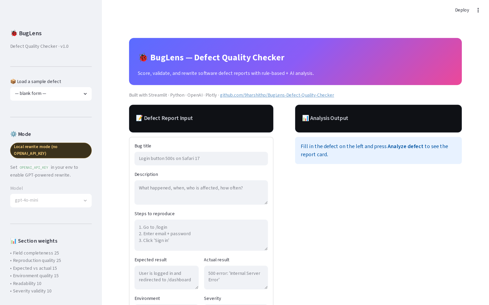
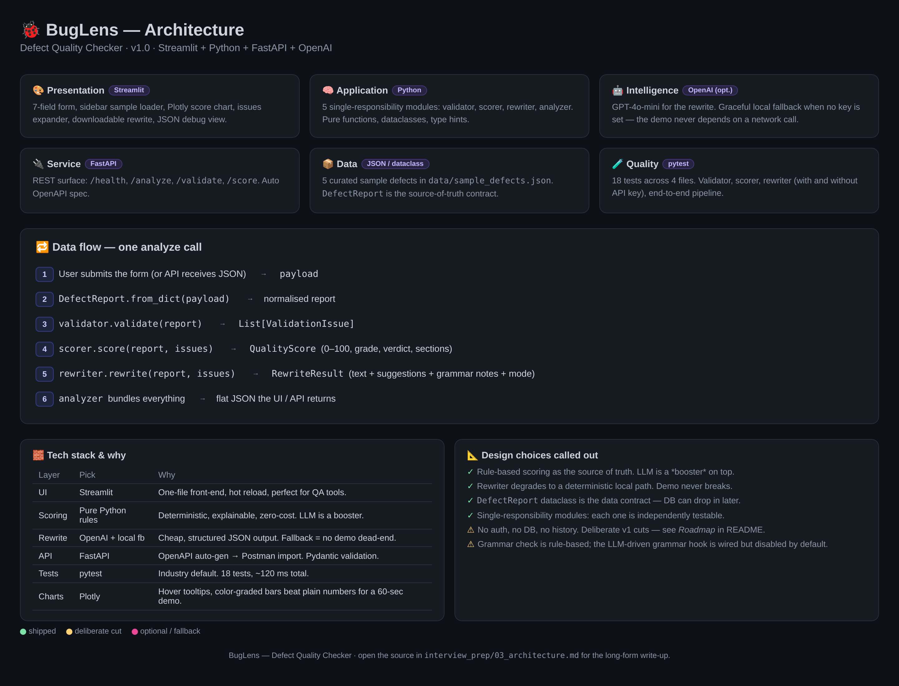

# 🐞 BugLens — Defect Quality Checker

> *Turning confusion into clarity.*

BugLens is a lightweight, AI-assisted web app that scores software defect
reports, flags missing information, and rewrites vague tickets into
professional, dev-ready bug reports — in under a second.

It pairs a **deterministic rule-based scoring engine** with an
**LLM-powered rewriter** that gracefully falls back to a local rule-based
writer when no API key is set. That means the demo never breaks.



For a static view of the architecture, see [`interview_prep/architecture.html`](interview_prep/architecture.html) or the rendered image below.



---

## ✨ Features

| Area | What you get |
| --- | --- |
| **Quality score** | 0–100 score with grade (A–F) and a plain-English verdict |
| **Section breakdown** | Per-section scoring across 6 weighted categories (Plotly bar chart) |
| **Validation** | Mandatory-field checks, vague-language detection, step formatting, env markers |
| **AI rewrite** | GPT-4o-mini rewriter with a fully local deterministic fallback |
| **REST API** | FastAPI service with `/analyze`, `/validate`, `/score`, `/health` |
| **Sample data** | 5 curated sample defects (excellent / mid / failing) loaded from sidebar |
| **Tests** | 18 unit tests covering validator, scorer, rewriter, and end-to-end pipeline |

---

## 🏗 Architecture

```
┌──────────────────┐        ┌────────────────────────────────┐
│  Streamlit UI    │ ─────► │  modules/  (validator/scorer/  │
│  (app.py)        │        │  ai_rewriter/analyzer)        │
└──────────────────┘        └─────────────┬──────────────────┘
                                         │
                                         ▼
                              ┌──────────────────────┐
                              │  OpenAI API (opt.)   │
                              │  Local rewriter (fb) │
                              └──────────────────────┘
                                         │
┌──────────────────┐        ┌─────────────▼──────────────────┐
│  Postman / curl  │ ─────► │  FastAPI  (api.py)             │
└──────────────────┘        └────────────────────────────────┘
```

Five single-responsibility modules under `modules/`:

| File | Role |
| --- | --- |
| `validator.py` | Pure rule-based field validation, returns `ValidationIssue` list |
| `scorer.py` | 0–100 scoring, 6 weighted sections, grade + verdict |
| `ai_rewriter.py` | LLM rewrite with deterministic local fallback |
| `analyzer.py` | Orchestrates validate → score → rewrite in one call |
| `app.py` | Streamlit UI (form + chart + issues + rewrite panel) |
| `api.py` | FastAPI REST surface (used by the Postman collection) |

---

## 🚀 Quick start

```bash
# 1. Clone
git clone https://github.com/9harshithp/BugLens-Defect-Quality-Checker.git
cd BugLens-Defect-Quality-Checker

# 2. Install
python -m venv .venv && source .venv/bin/activate
pip install -r requirements.txt

# 3. (Optional) enable AI rewrite
export OPENAI_API_KEY=sk-...

# 4. Run the UI
streamlit run app.py
# → open http://localhost:8501

When the app opens, sign in using one of the demo accounts:
- admin / admin123
- qa_lead / qa1234
- dev_user / dev5678
- analyst / pass2024

You can also create a new account from the login page.
```

### Run the REST API

```bash
uvicorn api:app --reload --port 8001
# → open http://localhost:8001/docs for Swagger UI
```

### Run the tests

```bash
python -m pytest tests/ -v
# → 18 passed
```

---

## 📊 Scoring model

Six sections, weights sum to 100:

| Section | Weight | What it checks |
| --- | --- | --- |
| Field completeness | 25 | Each of 7 fields has substance (min-word thresholds) |
| Reproduction quality | 25 | Steps are a numbered list, ≥ 2 actionable steps, mention UI/API elements |
| Expected vs actual | 15 | Both present, differ, and are specific |
| Environment quality | 15 | OS / browser / version markers present |
| Readability | 10 | Word count, sentence length, average word length |
| Severity validity | 10 | One of `blocker`/`critical`/`major`/`minor`/`trivial` |

Grade boundaries: **A** ≥ 85 · **B** ≥ 70 · **C** ≥ 55 · **D** ≥ 40 · **F** < 40.

---

## 🧪 Postman

Import `postman/BugLens.postman_collection.json` into Postman. Set
`baseUrl` to your host (default `http://127.0.0.1:8001`). The collection
ships with 6 requests covering health, validate, score, and three
analyze payloads (strong / mediocre / failing).

---

## 📁 Repo layout

```
.
├── app.py                     # Streamlit UI
├── api.py                     # FastAPI service
├── modules/                   # Core logic (validator, scorer, rewriter, analyzer)
├── data/sample_defects.json   # 5 demo defects
├── postman/                   # Postman collection + OpenAPI spec
├── tests/                     # 18 unit tests
├── docs/                      # Architecture notes
├── interview_prep/            # Interview artefacts (problem summary, demo script, …)
└── requirements.txt
```

---

## 🔒 Non-functional notes

- **Security:** API key read from env, never logged. No PII collected.
- **Scalability:** Streamlit + FastAPI both stateless; horizontally scalable.
- **Resilience:** Rewriter always falls back to a deterministic local path
  if OpenAI is unavailable — no demo dead-ends.
- **Usability:** All sections are collapsible; verdict is plain English;
  the rewrite is one click away from copy/download.

---

## 🛣 Roadmap

- Jira / Linear integration (write the rewrite straight to a ticket)
- Screenshot / log attachment analysis (multimodal)
- Duplicate-defect detection (embedding similarity)
- Severity prediction from history
- PDF / CSV export
- Multi-user, multi-tenant
